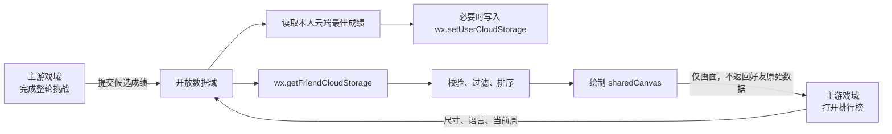

# 微信好友周排行榜开发规格

## 1. 文档状态

- 状态：待评审
- 功能范围：将微信小游戏现有的“本机本周排行榜”升级为“微信好友本周排行榜”
- 目标平台：微信小游戏
- Web 端：继续保留现有本机周排行榜，不接入微信好友关系链
- 本阶段文档不包含：代码修改、微信后台配置变更、正式发布

## 2. 当前工程现状

当前工程已经具备好友排行榜所需的大部分业务基础：

- 首页和游戏页均有排行榜入口。
- 已有完整的排行榜弹窗、空状态和前 6 名列表样式。
- 已有整轮计时状态 `CampaignRunState`。
- 玩家从第 1 关开始完成全部 30 关后，会生成一条本机周榜成绩。
- 当前排名指标为整轮总用时，时间越短排名越靠前。
- 当前成绩保存在微信本地存储中，不包含好友昵称、头像或云端数据。
- 当前 `game.json` 尚未配置开放数据域，工程中也没有开放数据域入口。

现有实现主要位于：

- `src/wechat/main.ts`：排行榜入口、弹窗绘制、整轮完成检测
- `src/storage/BrowserGameStorage.ts`：本机周榜读取与写入
- `src/game/types.ts`：整轮状态和本机榜数据类型
- `scripts/build-wechat.mjs`：微信小游戏构建与资源复制

## 3. 功能目标

玩家主动打开排行榜后，可以看到本周内玩过本游戏的微信好友排名，列表展示好友头像、昵称、名次和整轮通关用时。

本功能需要满足：

1. 继续沿用当前完整通关计时规则，不引入新的分数体系。
2. 每名玩家每周只保留一个最佳整轮成绩。
3. 好友关系链数据只在微信开放数据域中读取和绘制。
4. 主游戏域不接收、不保存好友昵称、头像、OpenID 或好友成绩明细。
5. 用户拒绝授权、断网或接口失败时，游戏本身仍可正常游玩。
6. 本机榜和好友榜数据不得混在同一个榜单中，避免重复或误导。

## 4. 排行规则

### 4.1 上榜条件

只有满足以下全部条件的成绩才可上榜：

- 玩家从“新游戏”开始一轮新的完整挑战。
- 从第 1 关开始，最终完成当前版本的全部 30 关。
- 完整通关发生在当前自然周内。
- 成绩数据结构合法，关卡数量与当前排行榜版本一致。

只完成单个关卡、回看历史解法、直接切换到已完成关卡或只完成部分关卡，均不会产生好友榜成绩。

### 4.2 计时规则

- 开始时间：玩家点击“新游戏”并进入第 1 关时。
- 结束时间：最后一关首次完成并触发整轮通关时。
- 总用时：`结束时间 - 开始时间`，按毫秒保存，界面按现有格式显示。
- 游戏进入后台、退出后重新进入或中途暂停时，计时继续累计。
- 玩家再次点击“新游戏”时，放弃上一轮计时并重新开始。

该规则沿用当前工程行为，同时避免通过切到后台暂停计时来获得不公平成绩。

### 4.3 每周范围

好友榜统一按北京时间（UTC+8）划分自然周：

- 每周一 00:00:00 开始。
- 下周一 00:00:00 结束。
- 周标识使用当周周一日期，例如 `2026-06-29`。
- 好友设备位于不同时区时，仍使用同一个北京时间周标识。

当前工程按设备本地时区计算周标识。开发时需要将微信好友榜改为固定 UTC+8 计算，避免好友之间出现跨周不一致。

### 4.4 最佳成绩与排序

- 每名玩家每周只保留总用时最短的一次成绩。
- 同一周再次完成但成绩更慢时，不覆盖云端最佳成绩。
- 同一周取得更快成绩时，覆盖该玩家原有成绩。
- 排序第一关键字：`durationMs` 升序。
- 相同毫秒成绩显示相同名次；内部使用 OpenID 做稳定排序，但不在界面显示。
- 新的一周无需批量删除旧数据，读取时只展示当前周标识匹配的成绩。

### 4.5 展示数量

沿用当前弹窗可容纳 6 行的布局：

- 当前玩家位于前 6 名时，显示前 6 名并高亮自己的行。
- 当前玩家有成绩但不在前 6 名时，显示前 5 名，最后一行显示玩家自己的实际名次。
- 当前玩家本周尚未完整通关时，显示前 6 名，并在底部提示“完成全部关卡后即可上榜”。
- 没有任何有效成绩时，显示现有奖杯兔子空状态。

## 5. 界面与交互

### 5.1 排行榜入口

继续使用现有两个入口：

- 首页“排行榜”按钮。
- 游戏页左上角排行榜图标。

第一次点击排行榜时才申请好友关系权限，不在游戏启动时提前弹出授权窗口。

建议授权说明文案：

> 用于展示你和已玩过本游戏的微信好友本周通关排名。

### 5.2 弹窗内容

弹窗外框、标题丝带和装饰继续由主游戏域绘制。好友列表区域由微信开放数据域绘制，并作为 `sharedCanvas` 嵌入现有内容框。

每一行包含：

- 名次
- 微信头像
- 微信昵称，过长时单行省略
- 整轮通关用时
- 当前玩家高亮状态

标题建议从“本周排行榜”调整为“好友周榜”，副标题调整为“完整通关总用时越短，排名越靠前”。

### 5.3 页面状态

| 状态 | 显示内容 | 用户操作 |
| --- | --- | --- |
| 加载中 | 骨架行或“正在加载好友排名…” | 可关闭弹窗 |
| 有数据 | 好友榜列表和自己的高亮行 | 可关闭弹窗 |
| 无数据 | 现有奖杯兔子空状态 | 开始新游戏 |
| 未上榜 | 好友榜正常显示，底部提示完成整轮后上榜 | 开始或继续游戏 |
| 未授权 | 说明好友榜需要微信朋友信息权限 | “去设置”或关闭 |
| 网络失败 | “好友榜暂时加载失败” | 点击主域绘制的刷新按钮或关闭 |
| 版本不支持 | “当前微信版本暂不支持好友榜” | 关闭；游戏不受影响 |

未授权、加载失败或版本不支持时，不应悄悄把本机榜伪装成好友榜。若需要展示本机记录，必须明确标注“本机成绩”。

## 6. 微信开放数据域方案

微信好友托管数据只能在开放数据域中读取，因此好友榜不能直接在现有 `src/wechat/main.ts` 中拉取好友数据。



### 6.1 主游戏域职责

- 在用户点击排行榜时检查并申请 `scope.WxFriendInteraction` 权限。
- 获取 `OpenDataContext`，设置共享画布尺寸。
- 通过 `postMessage` 向开放数据域发送渲染、刷新和成绩提交消息。
- 把开放数据域的 `canvas` 绘制到现有排行榜内容区域。
- 在弹窗中提供主域负责的固定刷新按钮，使加载失败时无需由开放数据域处理触摸事件。
- 处理未授权、去设置、接口不支持等主域状态。
- 继续保存本机榜和本周最佳候选成绩，但不保存好友关系链数据。

### 6.2 开放数据域职责

- 监听主域消息。
- 读取本人当前云端成绩，用于判断候选成绩是否更优。
- 必要时调用 `wx.setUserCloudStorage` 更新本人托管数据。
- 调用 `wx.getFriendCloudStorage` 获取同玩好友数据。
- 校验数据版本、周标识、关卡数和用时。
- 排序并绘制加载、成功、空列表和失败状态。
- 异步加载微信头像，加载失败时使用默认头像。
- 不将好友数据通过任何自定义方式传回主游戏域。

### 6.3 主域消息协议

消息保持扁平结构，字段值只使用字符串、数字或布尔值：

```ts
type FriendLeaderboardMessage =
  | {
      type: 'leaderboard.render';
      width: number;
      height: number;
      dpr: number;
      locale: 'zh-CN' | 'en-US';
      weekKey: string;
    }
  | {
      type: 'leaderboard.refresh';
      weekKey: string;
    }
  | {
      type: 'leaderboard.submit';
      schemaVersion: number;
      weekKey: string;
      durationMs: number;
      completedAtMs: number;
      levelCount: number;
    };
```

开放数据域应自行重新计算当前北京时间周标识，不能只信任主域传入的 `weekKey`。

## 7. 云端数据设计

### 7.1 托管数据 Key

建议固定使用一个 Key：

```text
patch_grid_friend_weekly_v1
```

每周继续复用同一个 Key 并更新其中的 `weekKey`，避免随着周数增加不断创建新的 Key。

### 7.2 Value 数据结构

```json
{
  "schemaVersion": 1,
  "weekKey": "2026-06-29",
  "durationMs": 482315,
  "completedAtMs": 1782923415000,
  "levelCount": 30
}
```

字段说明：

| 字段 | 类型 | 说明 |
| --- | --- | --- |
| `schemaVersion` | number | 排行榜数据协议版本 |
| `weekKey` | string | 北京时间当周周一日期 |
| `durationMs` | number | 完整通关总用时，毫秒 |
| `completedAtMs` | number | 完成时间戳，用于诊断和展示扩展 |
| `levelCount` | number | 产生该成绩时要求完成的关卡总数 |

该结构远小于微信单组 Key 与 Value 合计 1 KB 的限制。

### 7.3 数据校验

开放数据域读取任何成绩后都必须校验：

- Value 可以解析为 JSON 对象。
- `schemaVersion === 1`。
- `weekKey` 与当前北京时间周标识一致。
- `durationMs` 是有限正整数，且不超过一周毫秒数。
- `completedAtMs` 是有限正整数。
- `levelCount === 30`，后续关卡总数变化时同步升级协议版本或榜单 Key。

校验失败的数据直接忽略，不能影响其他好友行的显示。

## 8. 成绩上报与失败重试

### 8.1 上报时机

沿用当前整轮完成检测：最后一关完成、全部关卡记录齐全且整轮计时状态存在时，生成候选成绩。

处理顺序：

1. 本机照常记录本次完整通关成绩。
2. 保存一份“本周最佳候选成绩”。
3. 向开放数据域发送候选成绩。
4. 开放数据域读取本人已有托管成绩。
5. 本周没有成绩或候选成绩更快时才覆盖云端数据。
6. 写入流程结束后，开放数据域重新读取并绘制好友榜。

“先读取本人云端最佳再比较”的目的是：即使玩家删除并重装游戏，本机记录丢失，也不会用更慢的新成绩覆盖原来的云端最佳成绩。

### 8.2 重试策略

- 写入失败时不影响通关流程，也不连续弹出错误提示。
- 本周最佳候选成绩保存在本机；同一周只保留最短的一条。
- 下次启动游戏、微信 `onShow`、打开排行榜时尝试重发。
- 每次运行使用有限次数退避重试，避免断网时循环调用。
- 周标识过期的候选成绩直接丢弃，不上报到新一周。

由于开放数据域不能把自定义结果消息回传给主域，本机不等待“写入成功”回执，也不在当周提前删除最佳候选成绩。候选成绩保留到周切换，并在合适时机幂等重发；开放数据域始终先比较再写入，因此重复发送不会破坏云端最佳成绩。

## 9. 隐私、授权与安全边界

### 9.1 授权规则

- 只在玩家主动点击排行榜时请求 `scope.WxFriendInteraction`。
- 用户首次拒绝后，不反复自动弹窗。
- 再次点击时展示用途说明，并由用户主动点击“去设置”。
- 隐私保护指引中需要说明：好友榜会使用微信昵称、头像、同玩关系和游戏成绩。

### 9.2 数据最小化

- 主游戏域不读取好友原始数据。
- 好友昵称、头像、OpenID 和成绩只在开放数据域内短暂使用。
- 不把好友数据写入本地存储、日志、埋点或开发者服务器。
- OpenID 只用于识别本人和稳定排序，不展示给用户。

### 9.3 防作弊边界

微信用户托管数据由客户端写入，本方案适合休闲游戏中的轻量好友比较，但不能提供强防作弊保证。系统时间修改、调试器篡改和修改客户端上报参数仍可能产生异常成绩。

MVP 阶段采用以下基本防护：

- 只在现有完整通关状态机满足条件时生成成绩。
- 开放数据域严格校验数据范围、周标识、协议版本和关卡数。
- 只接受当前周、正数且不超过一周的用时。
- 不在客户端提供手工写分入口。

如果以后需要正式竞赛、奖励发放或全服榜，应增加服务端计时、通关事件校验和服务端排行榜，不能只依赖用户托管数据。

## 10. 计划修改的工程结构

批准开发后，建议新增或调整以下文件：

| 文件 | 计划职责 |
| --- | --- |
| `src/wechat/open-data/main.ts` | 开放数据域入口、好友数据读取、排序和 Canvas 绘制 |
| `src/wechat/FriendLeaderboardBridge.ts` | 主域授权、消息发送、共享画布管理 |
| `src/leaderboard/friend-leaderboard.types.ts` | 消息协议和成绩结构 |
| `src/leaderboard/friend-leaderboard.constants.ts` | Key、协议版本、周时区、行数和超时等常量 |
| `src/storage/BrowserGameStorage.ts` | 本周最佳候选成绩的本机持久化 |
| `src/wechat/main.ts` | 接入好友榜画布和各类界面状态 |
| `src/wechat-env.d.ts` | 补充开放数据域、授权和云存储 API 类型 |
| `scripts/build-wechat.mjs` | 增加开放数据域独立构建和配置输出 |
| `game.json` | 增加 `openDataContext` 目录配置，由构建脚本生成 |

开放数据域需要独立打包，不能直接依赖主游戏域运行状态。纯函数和类型可以由两个入口分别打入各自 Bundle。

## 11. 构建要求

微信构建需要同时输出：

```text
dist-wechat/
├── game.js
├── game.json
├── assets/
└── open-data/
    └── index.js
```

构建脚本需要：

1. 将 `src/wechat/main.ts` 构建为主域 Bundle。
2. 将开放数据域入口单独构建为 `dist-wechat/open-data/index.js`。
3. 为根目录开发者工具入口和 `dist-wechat` 目录分别生成正确的 `openDataContext` 相对路径。
4. 保证开放数据域 Bundle 不引用主域专用对象或浏览器 DOM。
5. 构建失败时直接终止，不能留下缺少开放数据域文件的半成品。

## 12. 性能与渲染要求

- 好友榜最多绘制 6 行，不在开放数据域中创建复杂滚动列表。
- 头像按 URL 做运行时缓存；关闭弹窗后可保留小规模内存缓存。
- 单个头像失败不得导致整个榜单失败。
- 打开排行榜时先立即绘制加载态，再异步替换为真实列表。
- 主域在排行榜打开期间以较低帧率持续合成 `sharedCanvas`，关闭后停止，避免常驻刷新耗电。
- 多次快速打开排行榜时，旧请求结果不得覆盖新一轮渲染状态。
- 接口超过约 8 秒未返回时显示失败状态，允许用户重试。

## 13. 验收用例

| 编号 | 场景 | 预期结果 |
| --- | --- | --- |
| 1 | 第一次点击排行榜并同意授权 | 显示加载态，随后显示好友周榜 |
| 2 | 第一次点击排行榜并拒绝授权 | 显示授权说明和“去设置”，游戏可继续 |
| 3 | 已拒绝后再次进入并在设置中开启 | 返回后可成功加载好友榜 |
| 4 | 本周没有任何好友成绩 | 显示空状态，不显示上周成绩 |
| 5 | 好友存在合法的本周成绩 | 按用时从短到长排序 |
| 6 | 好友数据 JSON 损坏或字段缺失 | 只忽略该好友，不影响其他行 |
| 7 | 当前玩家位于前 6 名 | 自己的行高亮显示 |
| 8 | 当前玩家排名低于第 6 名 | 显示前 5 名和自己的实际名次 |
| 9 | 当前玩家未上榜 | 显示好友前 6 名和上榜提示 |
| 10 | 同一玩家本周成绩变快 | 云端最佳成绩被更新 |
| 11 | 同一玩家本周成绩变慢 | 不覆盖云端最佳成绩 |
| 12 | 删除并重装后完成一条更慢成绩 | 读取云端旧成绩后保留更快成绩 |
| 13 | 完整通关时断网 | 通关正常，本周最佳候选成绩保留在本机 |
| 14 | 恢复网络后重新打开排行榜 | 候选成绩被幂等补交并刷新榜单 |
| 15 | 周一跨周后打开排行榜 | 只显示新一周成绩，旧成绩不出现 |
| 16 | 设备处于不同时区 | 使用同一个北京时间周标识 |
| 17 | 好友昵称很长或包含 emoji | 单行安全截断，其他列不被挤压 |
| 18 | 好友头像加载失败 | 显示默认头像，名次和成绩正常 |
| 19 | 快速反复打开、关闭排行榜 | 不闪回旧数据，不持续后台刷新 |
| 20 | 微信接口不支持或加载失败 | 显示明确降级状态，不影响游戏 |
| 21 | Web 端打开排行榜 | 继续显示本机周榜，不调用微信 API |
| 22 | 两个真实微信账号互为好友并均完成整轮 | 双方好友榜能看到一致的排名 |

真机联调需要至少两个互为微信好友、且都进入过该小游戏的账号。微信官方说明新增微信好友后的短时间内可能暂时取不到对方数据，因此新加好友场景不能作为唯一验收依据。

## 14. 官方能力依据

- [关系链数据与开放数据域](https://developers.weixin.qq.com/minigame/dev/guide/open-ability/open-data.html)
- [wx.getFriendCloudStorage](https://developers.weixin.qq.com/minigame/dev/api/open-api/data/wx.getFriendCloudStorage.html)
- [wx.getUserCloudStorage](https://developers.weixin.qq.com/minigame/dev/api/open-api/data/wx.getUserCloudStorage.html)
- [wx.setUserCloudStorage](https://developers.weixin.qq.com/minigame/dev/api/open-api/data/wx.setUserCloudStorage.html)
- [wx.getOpenDataContext](https://developers.weixin.qq.com/minigame/dev/api/open-api/context/wx.getOpenDataContext.html)
- [OpenDataContext.postMessage](https://developers.weixin.qq.com/minigame/dev/api/open-api/context/OpenDataContext.postMessage.html)
- [wx.onMessage](https://developers.weixin.qq.com/minigame/dev/api/open-api/context/wx.onMessage.html)
- [wx.getSharedCanvas](https://developers.weixin.qq.com/minigame/dev/api/open-api/data/wx.getSharedCanvas.html)
- [微信小游戏授权说明](https://developers.weixin.qq.com/minigame/dev/guide/base-ability/authorize.html)

## 15. 评审时需要确认的项目

本稿默认采用以下产品规则，确认后即可进入开发：

1. 好友榜继续比较完整通关 30 关的整轮总用时，而不是单关成绩或通关关数。
2. 每名玩家每周只保留最短的一次成绩。
3. 自然周统一使用北京时间周一 00:00 切换。
4. 弹窗显示前 6 名；自己不在前 6 名时显示前 5 名加自己的实际名次。
5. 微信端默认展示好友榜；Web 端继续展示本机榜。
6. 未授权或网络失败时不把本机榜混入好友榜，只显示明确的降级提示。
7. MVP 使用微信用户托管数据，不建设服务端，不承诺强防作弊能力。
8. 用户重置本机游戏数据时，不删除已经上报的本周云端最佳成绩。
